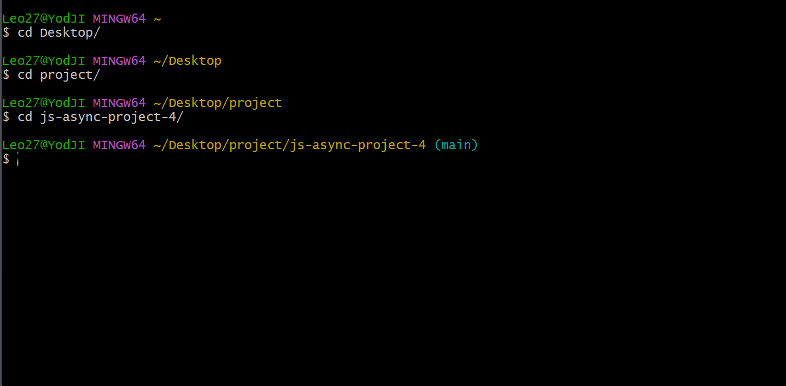

## Статусы

## Пошаговый пример работы программы

## Шаг 1 (Скачивание html файла)

## Шаг 2 (Скачивание img)

## Шаг 3 (Скачивание link & script)

## Шаг 4 (DEBUG)

## Шаг 5 (Обработка ошибок)

## Шаг 6 (Отображения прогресса с помощью библиотеки listr)

